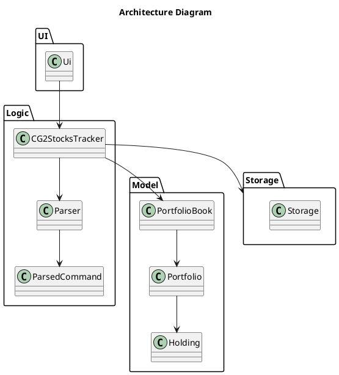
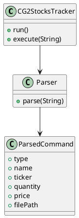

# Developer Guide

## Acknowledgements

{list here sources of all reused/adapted ideas, code, documentation, and third-party libraries -- include links to the original source as well}

## Design & implementation

# Developer Guide

## Design

### Architecture

The Architecture Diagram above gives an overview of the main components in the application and how they interact.

The application consists of four main components:

- **UI**: Handles user input and output

- **Logic**: Executes commands

- **Model**: Stores application data in memory

- **Storage**: Reads and writes data to disk

The `CG2StocksTracker` class acts as the main entry point of the application. It is responsible for initializing these components and coordinating the execution of commands.

---

### How the components interact

When a user enters a command, the flow is as follows:

1. The command is read by `Ui`

2. The command string is passed to `CG2StocksTracker`

3. `Parser` parses the command and returns a `ParsedCommand`

4. `CG2StocksTracker` executes the command using the Model

5. If the command modifies data, `Storage` saves the updated state

6. The result is returned to `Ui` for display

---

### Architecture Diagram

---

## UI Component

### Overview

The API of this component is specified in `Ui.java`.

The `Ui` component is responsible for interacting with the user. It reads input commands and displays results or error messages.

---

### How the UI works

- `Ui` reads user input as a string

- It forwards the input to `CG2StocksTracker`

- It displays the output returned by the application

The UI does not perform any parsing or business logic.

---

## Logic Component

### Overview

The Logic component is implemented mainly by:

- `CG2StocksTracker`

- `Parser`

- `ParsedCommand`

---

### How the Logic component works

When a command is executed:

1. `CG2StocksTracker` receives the command string

2. The command is passed to `Parser`

3. `Parser` converts the string into a `ParsedCommand`

4. `CG2StocksTracker` inspects the command type

5. The corresponding operation is executed

---

### Class Diagram

---

### Design considerations

The application uses a single `ParsedCommand` class instead of separate command classes.

This approach was chosen because:

- It keeps the number of classes small

- It simplifies the parsing process

However, it means that adding new commands requires modifying existing code instead of adding new classes.

---

## Model Component

### Overview

The Model component stores all application data in memory.

It consists of:

- `PortfolioBook`: manages multiple portfolios

- `Portfolio`: manages holdings within a portfolio

- `Holding`: represents a single asset

---

### How the Model works

- `PortfolioBook` stores all portfolios and tracks the active portfolio

- `Portfolio` stores holdings using an internal collection

- `Holding` stores ticker, quantity, and price

---

### Class Diagram

---

### Design considerations

The Model does not depend on UI or Storage.

This ensures that:

- Business logic is kept separate

- The Model can be tested independently

- Changes to UI or Storage do not affect the Model

---

## Storage Component

### Overview

The API of this component is specified in `Storage.java`.

The Storage component is responsible for:

- Saving application data to disk

- Loading data from disk

- Processing CSV files for bulk updates

---

### How the Storage component works

- `save(...)` writes the current state to file

- `load(...)` reads data during application startup

- `loadPriceUpdates(...)` processes CSV input

---

### Design considerations

CSV processing is implemented in `Storage` instead of `Parser` because:

- It involves file handling

- It is not part of command parsing

---

# Implementation

---

## Command execution

This section describes how commands are executed in the application.

---

### Sequence Diagram

---

### Explanation

This diagram shows the general flow for all commands.

The important points are:

- All commands go through `CG2StocksTracker`

- Parsing is handled separately by `Parser`

- The Model performs the actual operation

- Storage is only involved when data changes

---

## Create portfolio

### Implementation

The `create` command creates a new portfolio.

Steps:

1. Command is parsed into `ParsedCommand`

2. `CG2StocksTracker` calls `PortfolioBook.createPortfolio(name)`

3. The new portfolio is added

4. If no active portfolio exists, it is set as active

5. The updated state is saved

6. A message is displayed

---

### Sequence Diagram

---

### Explanation

This diagram shows a simple state-changing command.

The main point is that:

- Portfolio creation is handled by `PortfolioBook`

- The controller does not manage internal data structures

- The state is saved immediately after modification

---

## Add holding

### Implementation

The `add` command adds a holding to the active portfolio.

Steps:

1. Retrieve active portfolio

2. Call `Portfolio.addHolding(...)`

3. Update existing holding or create new one

4. Save state

5. Display result

---

### Explanation

The logic is handled inside `Portfolio` to ensure that:

- Holdings are managed consistently

- The controller does not duplicate logic

---

## Delete holding

### Implementation

The `remove` command removes a holding.

If the holding does not exist, an error is returned.

---

### Sequence Diagram

---

### Explanation

This diagram shows two possible outcomes:

- If the holding exists, it is removed and saved

- If it does not exist, an error is shown

This ensures that invalid operations do not modify the system state.

---

## Bulk price update

### Implementation

The `setmany` command updates prices using a CSV file.

Steps:

1. Parse file path

2. Call `Storage.loadPriceUpdates(...)`

3. Process each row

4. Update holdings

5. Return summary

---

### Sequence Diagram

---

### Explanation

The loop in this diagram represents processing multiple rows.

The key idea is that:

- Batch processing is handled in `Storage`

- The controller does not handle iteration logic

---

# Design Considerations

---

## Command handling

Using `ParsedCommand` simplifies the system but reduces extensibility.

---

## Error handling

Exceptions are used to ensure that errors are not ignored.

---

## Product scope
### Target user profile

{Describe the target user profile}

### Value proposition

{Describe the value proposition: what problem does it solve?}

## User Stories

| Version | Role             | Feature                                                     | Benefit                                              | Category                    |
|--------|------------------|-------------------------------------------------------------|------------------------------------------------------|-----------------------------|
| 1.0    | Amateur investor | create a new portfolio from the CLI                         | separate long-term investing from short-term trades   | Core portfolio management   |
| 1.0    | Investor         | add a stock, ETF, or bond to my portfolio via the CLI       | track what I own without using spreadsheets           | Core portfolio management   |
| 1.0    | Investor         | remove a holding from my portfolio                          | keep records accurate when I exit a position          | Core portfolio management   |
| 1.0    | Investor         | view a list of all my current holdings                      | quickly see what my portfolio consists of             | Portfolio view              |
| 1.0    | Investor         | update prices for my holdings                               | reflect current market conditions                     | Market data                 |
| 2.0    | Investor         | record units/shares and average buy price                   | calculate gains and losses correctly                  | Core portfolio management   |
| 2.0    | Investor         | record fees (brokerage, FX, platform fees) per trade        | reflect true returns                                 | Performance accuracy        |
| 2.0    | Investor         | see the current total value of my portfolio                 | know what my investments are worth right now          | Portfolio value             |
| 2.0    | Investor         | see gains or losses per holding                             | know which assets help or hurt performance            | Performance insights        |
| 2.0    | Investor         | see unrealized vs realized gains separately                 | distinguish paper gains from locked-in results        | Performance insights        |

## Non-Functional Requirements

{Give non-functional requirements}

## Glossary

* *glossary item* - Definition

## Instructions for manual testing

{Give instructions on how to do a manual product testing e.g., how to load sample data to be used for testing}
